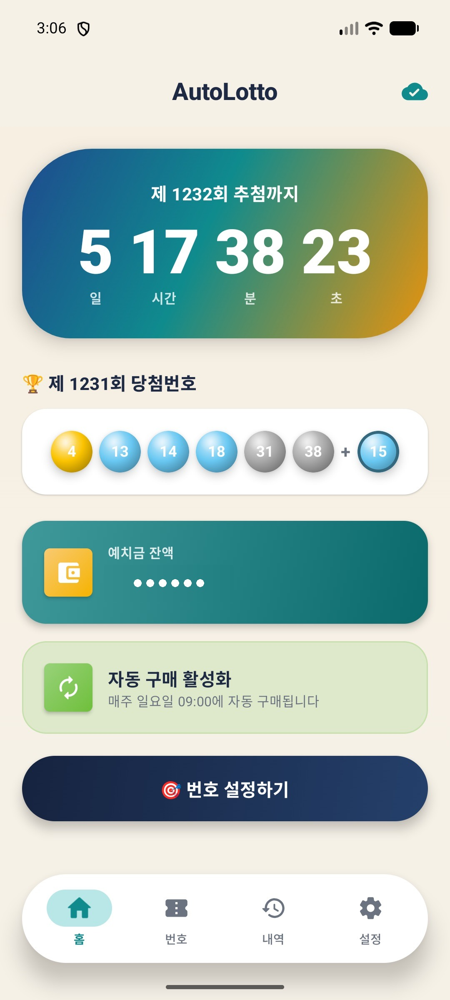
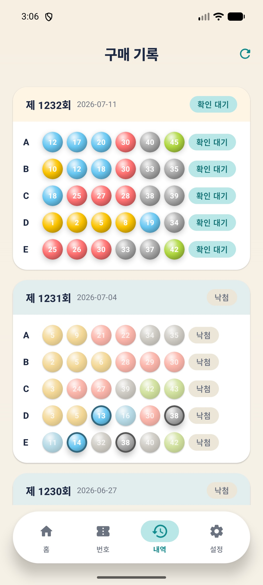
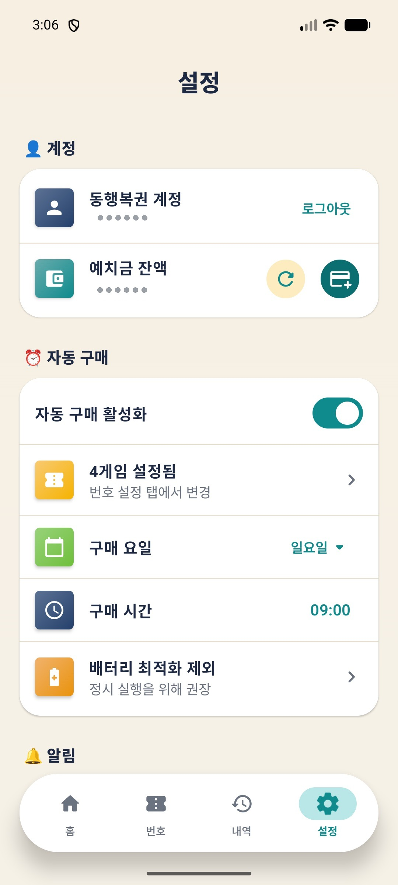

# 🎰 AutoLotto

동행복권 로또 6/45 자동 구매 & 당첨 확인 앱

[](LICENSE)
[](https://kotlinlang.org)
[](https://developer.android.com/jetpack/compose)
[](https://developer.android.com)


<p align="center">
  <a href="https://autolotto.umicorp.kr">
    
  </a>
</p>

## ✨ 주요 기능

- **자동 구매** — 설정한 요일/시간에 자동으로 로또 구매 (최대 5게임)
- **수동/자동 번호** — 게임별로 수동 번호 지정 또는 자동 생성 선택
- **당첨 확인** — 매주 토요일 21:00 자동 당첨 확인 & 푸시 알림
- **구매 기록** — 게임별 번호, 등수, 당첨금 한눈에 확인
- **보안 저장** — 계정 정보는 Android Keystore(EncryptedSharedPreferences) 암호화 저장
- **모던 디자인** — Material 3 Expressive 'Lucky Gloss', 네이티브 Jetpack Compose · 스프링 인터랙션
- **자동 업데이트** — 앱 내에서 새 버전 원탭 설치 (사이드로드 배포)

## 📱 스크린샷

<p align="center">
  
  
  
  
</p>

## 🔧 빌드 방법

### 요구 사항

- Android SDK 36 (compileSdk / targetSdk 36), minSdk 31 (Android 12+)
- JDK 17
- Android Studio 또는 Gradle

### 빌드 & 설치

```bash
# 디버그 빌드 + 유닛 테스트
./gradlew :app:assembleDebug :app:testDebugUnitTest

# 릴리스 APK (서명: 루트 key.properties 필요)
./gradlew :app:assembleRelease
```

빌드된 APK: `app/build/outputs/apk/release/app-release.apk`
릴리스 서명은 루트 `key.properties`(gitignore)가 있을 때만 활성화됩니다.

## 📂 프로젝트 구조

```
app/src/main/kotlin/com/umicorp/autolotto/
├── MainActivity.kt              # 진입점 (Compose setContent)
├── AppContainer.kt              # 앱 스코프 컴포지션 루트 (상태·서비스·업데이트)
├── dhlottery/                   # 동행복권 역공학 세션
│   ├── AuthService.kt           # RSA 로그인 (도메인별 쿠키)
│   ├── PurchaseService.kt       # 로또 구매 (execBuy.do)
│   ├── ResultService.kt         # 당첨번호 조회
│   ├── HistoryService.kt        # 구매 내역
│   ├── DhlotterySession.kt      # OkHttp 세션 (수동 리다이렉트)
│   └── RsaCrypto.kt             # RSA PKCS1
├── data/
│   ├── SecureStore.kt           # EncryptedSharedPreferences (+ Flutter 마이그레이션)
│   ├── Purchase.kt
│   └── WinningResult.kt
├── scheduler/                   # AlarmManager 자가연쇄 + WorkManager
│   ├── AlarmScheduler.kt        # 알람 등록 (자동구매 1001 / 결과확인 1002)
│   ├── AutoPurchaseWorker.kt    # 백그라운드 자동 구매
│   ├── CheckResultWorker.kt     # 백그라운드 당첨 확인
│   ├── SchedulerReceivers.kt    # 부팅·앱 업데이트 시 알람 복원
│   └── Notifications.kt         # 알림 (구매/당첨/잔액)
├── update/
│   └── AppUpdater.kt            # 인앱 업데이트 (GitHub 릴리스 확인·설치)
└── ui/                          # Jetpack Compose · Material 3 Expressive
    ├── App.kt                   # 하단 pill 네비 + 4탭 페이저
    ├── SplashScreen.kt          # 스플래시 (자동 로그인)
    ├── screen/                  # Home · Number · History · Settings
    ├── theme/                   # Lucky Gloss 테마·색·모션
    └── util/                    # 볼 색상·포맷 등 UI 헬퍼
```

## 🔐 보안

- 계정 정보는 **EncryptedSharedPreferences**(Android Keystore)로 암호화 저장 (Flutter판에서 자동 마이그레이션)
- 로그인 비밀번호는 동행복권 서버의 **RSA 공개키로 암호화** 후 전송
- 디버그 로그는 릴리즈 빌드에서 비활성화
- 모든 API 통신은 HTTPS

## ⚠️ 주의사항

- 이 앱은 **동행복권(dhlottery.co.kr) 계정**이 필요합니다
- 로또 구매에는 **예치금 충전**이 선행되어야 합니다
- 구매 가능 시간: 평일/일요일 06:00\~23:59, 토요일 06:00\~19:59
- 자동 구매가 정상 동작하려면 **배터리 최적화 제외** 설정을 권장합니다
- Google Play 도박 정책으로 인해 **스토어 배포 불가** → GitHub APK 직접 배포

## ⚖️ 면책 조항

동행복권의 공식 앱이 아니며, 사용에 따른 모든 책임은 사용자에게 있습니다. 동행복권 이용약관을 확인하고 본인의 판단 하에 사용하시기 바랍니다.

## 📄 라이선스

[MIT License](LICENSE) — 자유롭게 사용, 수정, 배포 가능합니다.

